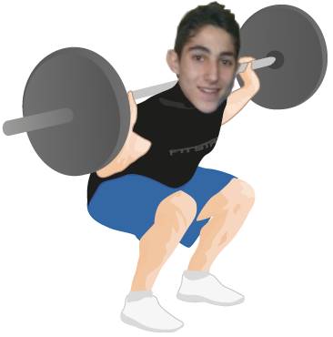

# SpotBuddy
AI powered form spotting for novice weight-lifters.

Using Tensorflow's mobile posenet and machine learning, this project attempts to classify errors in squat form.

it is currently still in prototype stage. We will be publishing our first beta April.

