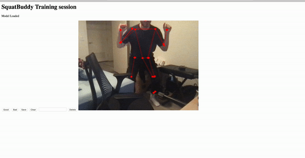

# SpotBuddy
AI powered form spotting for novice weight-lifters.

Using Tensorflow's mobile posenet and machine learning, this project attempts to classify errors in squat form.

it is currently still in prototype stage. We will be publishing our first beta April.

# Build Instructions
1. Create anaconda environment 
2. `conda install -c anaconda flask`
3. `export FLASK_ENV=development`
4. In the root of this repo, do `flask run`

Then You should be able to go to http://localhost:5000/

## Dependencies
-- todo --

## Note
If you would like access to the full dataset, please contact me. We currently are not publishing our dataset and full model. You can view a sample in the notebook in this repo.
